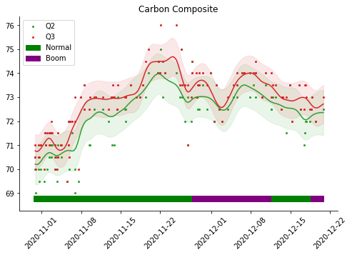
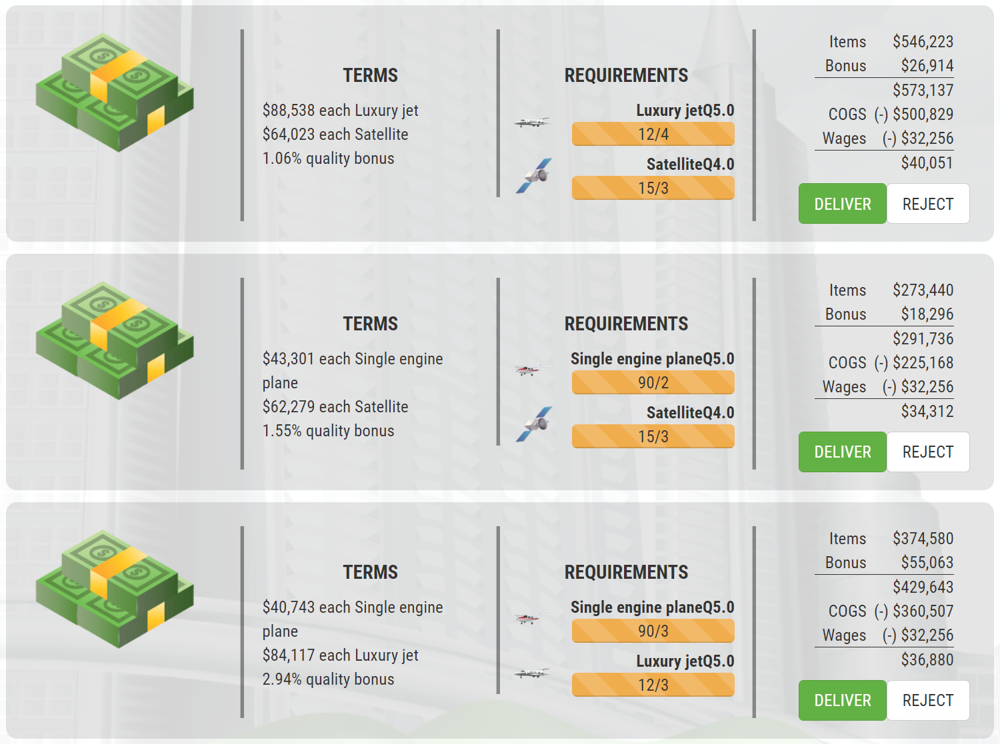
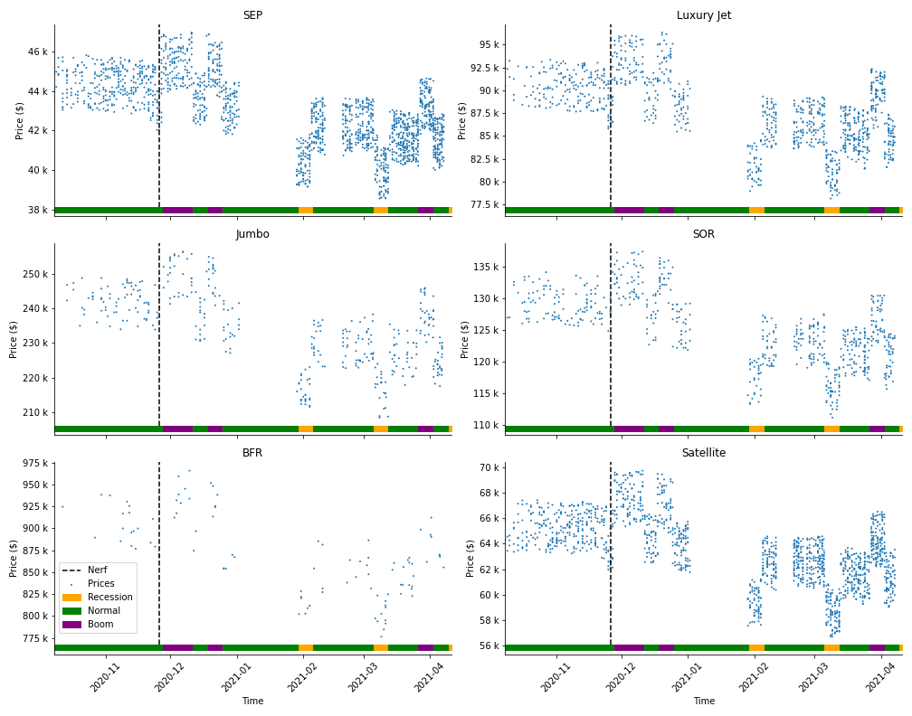

# simco-utils
`simco-utils` provides utilities for the online multiplayer game *Sim Companies* (https://www.simcompanies.com/).

## Installation
Clone this repository
```bash
git clone https://github.com/short-fuss/simco-utils.git
```

Create a conda environment using the supplied YAML specification:
```bash
conda env create --file environment.yml
```

## Commodity Prices
To obtain commodity prices, you can call
```bash
python get_prices
```

This will pull down all exchange listings from the SimCompanies API and store the current best price for each quality level of each commodity. The file will be stored as a CSV in the top-level file `prices.csv` (always overwritten), and in a storage folder with date-stamp to keep your own  history. By default, this is set to the folder `CommodityPrices`, which is on the git ignore list.

The `plotting.py` module provides plotting utilities, which are demonstrated in the Jupyter notebook `price_history.ipynb`. An example plot for the price history of Carbon Composite is shown here:
<p align="center">
  
</p>

Note how the economy is also indicated in the axis abscissa. This is made possible by a manually-maintained list of economy changes in the `Prices` class defined in `plotting.py`.


## Sales Office

### Parsing
The `parse_salesoffice.py` utility enables you to extract your Sales Office orders. To use this utility, you have two options:

#### 1. PNG screenshots
The first option is to save screenshots of your orders (as PNG files). E.g.
<p align="center">
  
</p>

Under the hood, the tesseract optical character recognition (OCR) system is used to extract the text from the image. This is then converted to an HDF file (via `pandas`) that contains the prices in the *terms*. 

Then you can call 
```bash
python parse_salesoffice.py --economy=N example_salesoffice.png
```

The economy argument is required. You should supply either `N` (normal), `R` (recession) or `B` (boom). This economy key is then stored alongside the prices.

There are several drawbacks of using this approach:
- OCR is slow 
- Tesseract must be installed separately
- You will need multiple screenshots for each sales office when you have more than ~5 levels.
- Currently, this approach doesn't identify the quantity of each commodity required, because tesseract doesn't identify text within the orange striped bars

#### 2. Text dump
The easier and better option is to copy the text from the page (Ctrl-A, Ctrl-C), and save to a `.txt` file. The same call as above works, with the internal logic distinguishing between `.png` and `.txt` files, and processing accordingly.

By default, the HDF files are stored in the folder `SalesOfficePrices`, but this can be changed by providing your own to the command-line option `--output_dir`.

### Analysis
The `analyse_salesoffice.py` script then enables you to identify the current prices, which takes a weighted average of your prices data. Higher weights are given to more recent prices, and the degree of preference is controlled by the argument `weight_decay`.

### Visualization
To visualize the prices and quantities, use the `sales_office.ipynb` notebook. This provides a plot of all your prices data which looks like this:
<p align="center">
  
</p>